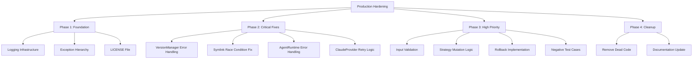
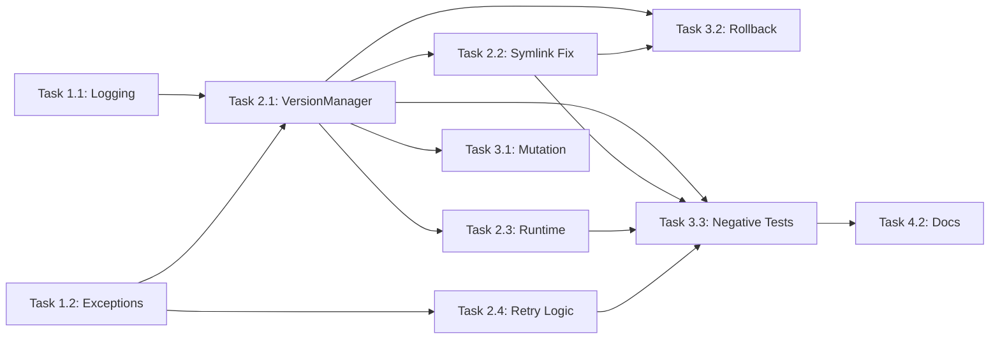

---

## 2. WBS 任务分解

### 2.1 分解结构图



### 2.2 任务清单

#### Phase 1: Foundation（6 任务点）

**文件**: `src/common/logger.py` (NEW), `src/common/exceptions.py` (NEW), `LICENSE` (NEW)

- [x] **Task 1.1**：创建日志基础设施（2 点）
  - **输入**：无
  - **输出**：`src/common/logger.py` 模块
  - **关键步骤**：
    1. 创建 `setup_logger()` 函数，支持 console + file handlers
    2. 配置格式化器（timestamp, level, message, function, line）
    3. 添加单元测试验证 console 和 file 输出
  - **验证**：`pytest tests/unit/test_logger.py -v`

- [x] **Task 1.2**：创建异常层次结构（2 点）
  - **输入**：无
  - **输出**：`src/common/exceptions.py` 模块
  - **关键步骤**：
    1. 定义基类 `SelfTuningAgentError`
    2. 定义子类：`VersionNotFoundError`, `VersionAlreadyExistsError`, `InvalidVersionStateError`, `FileOperationError`, `ProviderError`
    3. 添加单元测试验证异常继承关系
  - **验证**：`pytest tests/unit/test_exceptions.py -v`

- [x] **Task 1.3**：添加 LICENSE 文件（1 点）
  - **输入**：README.md line 221 声明 MIT License
  - **输出**：`LICENSE` 文件
  - **关键步骤**：
    1. 创建 MIT License 文本
    2. 设置 Copyright (c) 2026 AlexiosNine
  - **验证**：文件存在且内容正确

- [x] **Task 1.4**：添加 Config 日志配置（1 点）
  - **输入**：Task 1.1 完成
  - **输出**：`src/common/config.py` 修改
  - **关键步骤**：
    1. 在 `AppConfig` 添加 `log_level` 和 `log_file` 字段
    2. 在 `load_config()` 中初始化 logger
  - **验证**：配置加载时日志正常输出

---

#### Phase 2: Critical Error Handling（8 任务点）

**文件**: `src/harness/version_manager.py`, `src/agent/runtime.py`, `src/agent/providers/claude.py`

- [x] **Task 2.1**：VersionManager 错误处理（3 点）
  - **输入**：Task 1.1, 1.2 完成
  - **输出**：`src/harness/version_manager.py` 修改
  - **关键步骤**：
    1. `load_version()`: 添加 try-except 捕获 `FileNotFoundError`, `json.JSONDecodeError`
    2. `load_prompt_config()`: 添加 try-except 捕获 `yaml.YAMLError`
    3. `create_version()`: 添加 try-except 捕获 `FileExistsError`, `OSError`
    4. 所有方法添加日志记录（info 成功，error 失败）
  - **验证**：
    ```python
    # tests/unit/test_version_manager.py
    def test_load_version_not_found(manager):
        with pytest.raises(VersionNotFoundError):
            manager.load_version("nonexistent")
    
    def test_load_version_corrupted_json(manager, tmp_path):
        (tmp_path / "v001" / "metadata.json").write_text("invalid json")
        with pytest.raises(FileOperationError):
            manager.load_version("v001")
    ```

- [x] **Task 2.2**：修复 Symlink 竞态条件（2 点）
  - **输入**：Task 2.1 完成
  - **输出**：`src/harness/version_manager.py` 的 `promote_to_production()` 修改
  - **关键步骤**：
    1. 使用原子操作：创建临时 symlink → rename 替换
    2. 添加 try-except 捕获 `OSError`
    3. 添加日志记录 symlink 操作
  - **代码示例**：
    ```python
    def promote_to_production(self, version_id: str) -> None:
        version_dir = self.strategies_dir / version_id
        if not version_dir.exists():
            raise VersionNotFoundError(f"Version {version_id} does not exist")
        
        current_link = self.strategies_dir / "current"
        temp_link = self.strategies_dir / f".current.tmp.{os.getpid()}"
        
        try:
            # Atomic symlink creation
            temp_link.symlink_to(version_dir, target_is_directory=True)
            temp_link.replace(current_link)  # Atomic replace
            logger.info(f"Promoted {version_id} to production")
        except OSError as e:
            logger.error(f"Failed to promote {version_id}: {e}")
            if temp_link.exists():
                temp_link.unlink()
            raise FileOperationError(f"Symlink operation failed") from e
        
        # Update metadata
        version = self.load_version(version_id)
        updated = version.model_copy(update={"status": StrategyStatus.PRODUCTION})
        try:
            (version_dir / "metadata.json").write_text(updated.model_dump_json(indent=2))
        except OSError as e:
            logger.error(f"Failed to update metadata for {version_id}: {e}")
            raise FileOperationError(f"Metadata update failed") from e
    ```
  - **验证**：
    ```python
    def test_promote_concurrent_safe(manager, tmp_path):
        # Simulate concurrent promotion
        import threading
        errors = []
        def promote():
            try:
                manager.promote_to_production("v001")
            except Exception as e:
                errors.append(e)
        
        threads = [threading.Thread(target=promote) for _ in range(5)]
        for t in threads:
            t.start()
        for t in threads:
            t.join()
        
        # Only one should succeed
        assert len(errors) <= 4
    ```

- [x] **Task 2.3**：AgentRuntime 错误处理（2 点）
  - **输入**：Task 2.1 完成
  - **输出**：`src/agent/runtime.py` 修改
  - **关键步骤**：
    1. `answer()`: 添加 try-except 捕获 `VersionNotFoundError`, `ProviderError`
    2. 添加日志记录请求和响应
    3. 添加输入验证（question 非空，长度 <= 10000）
  - **代码示例**：
    ```python
    def answer(self, question: str) -> AnswerResult:
        # Input validation
        if not question or not question.strip():
            logger.error("Empty question provided")
            raise ValueError("Question cannot be empty")
        if len(question) > 10000:
            logger.error(f"Question too long: {len(question)} chars")
            raise ValueError("Question exceeds 10000 characters")
        
        logger.info(f"Answering question: {question[:100]}...")
        
        try:
            current_link = self.version_manager.strategies_dir / "current"
            if not current_link.exists():
                raise VersionNotFoundError("No production version set")
            
            version_id = current_link.resolve().name
            prompt_config = self.version_manager.load_prompt_config(version_id)
            
            request = ProviderRequest(
                system_prompt=render_system_prompt(prompt_config),
                user_prompt=question,
                model_name=self.model_name,
            )
            
            answer = self.provider.generate(request)
            logger.info(f"Generated answer (version={version_id}): {answer[:100]}...")
            
            return AnswerResult(
                answer=answer,
                strategy_version=version_id,
                model_name=self.model_name
            )
        except VersionNotFoundError:
            logger.error("Production version not found")
            raise
        except Exception as e:
            logger.error(f"Failed to generate answer: {e}")
            raise
    ```
  - **验证**：
    ```python
    def test_answer_empty_question(runtime):
        with pytest.raises(ValueError, match="cannot be empty"):
            runtime.answer("")
    
    def test_answer_long_question(runtime):
        with pytest.raises(ValueError, match="exceeds 10000"):
            runtime.answer("x" * 10001)
    ```

- [x] **Task 2.4**：ClaudeProvider 重试逻辑（1 点）
  - **输入**：Task 1.2 完成
  - **输出**：`src/agent/providers/claude.py` 修改
  - **关键步骤**：
    1. 添加 `tenacity` 依赖到 `pyproject.toml`
    2. 使用 `@retry` 装饰器，最多重试 3 次，指数退避
    3. 添加日志记录 API 调用和重试
  - **代码示例**：
    ```python
    from tenacity import retry, stop_after_attempt, wait_exponential, retry_if_exception_type
    from anthropic import APIError, RateLimitError
    from src.common.logger import setup_logger
    from src.common.exceptions import ProviderError
    
    logger = setup_logger(__name__)
    
    class ClaudeProvider:
        def __init__(self, client: Anthropic) -> None:
            self.client = client
        
        @retry(
            stop=stop_after_attempt(3),
            wait=wait_exponential(multiplier=1, min=2, max=10),
            retry=retry_if_exception_type((APIError, RateLimitError)),
            reraise=True
        )
        def generate(self, request: ProviderRequest) -> str:
            logger.info(f"Calling Claude API: model={request.model_name}")
            
            try:
                response = self.client.messages.create(
                    model=request.model_name,
                    max_tokens=512,
                    system=request.system_prompt,
                    messages=[{"role": "user", "content": request.user_prompt}],
                )
                
                first_block = response.content[0]
                if isinstance(first_block, TextBlock):
                    text: str = first_block.text
                    logger.info(f"Claude response: {len(text)} chars")
                    return text
                
                logger.warning("No text block in response")
                return ""
            except (APIError, RateLimitError) as e:
                logger.warning(f"Claude API error (will retry): {e}")
                raise
            except Exception as e:
                logger.error(f"Unexpected error calling Claude: {e}")
                raise ProviderError(f"Provider call failed: {e}") from e
    ```
  - **验证**：
    ```python
    def test_generate_with_retry(mocker):
        client = mocker.Mock()
        client.messages.create.side_effect = [
            RateLimitError("Rate limit"),
            RateLimitError("Rate limit"),
            mocker.Mock(content=[TextBlock(text="Success")])
        ]
        
        provider = ClaudeProvider(client)
        result = provider.generate(request)
        
        assert result == "Success"
        assert client.messages.create.call_count == 3
    ```

---

#### Phase 3: High Priority Enhancements（7 任务点）

**文件**: `src/harness/optimizer.py`, `src/harness/version_manager.py`

- [x] **Task 3.1**：改进策略变异逻辑（2 点）
  - **输入**：Task 2.1 完成
  - **输出**：`src/harness/optimizer.py` 修改
  - **关键步骤**：
    1. 添加多种变异策略（不仅仅是硬编码字符串拼接）
    2. 从评估结果中提取改进方向
    3. 添加日志记录变异决策
  - **代码示例**：
    ```python
    from enum import StrEnum
    from src.common.logger import setup_logger
    
    logger = setup_logger(__name__)
    
    class MutationType(StrEnum):
        ADD_DEFINITION = "add_definition"
        ADD_EXAMPLE = "add_example"
        SIMPLIFY = "simplify"
        ADD_CONSTRAINT = "add_constraint"
    
    class StrategyOptimizer:
        def __init__(self, version_manager: VersionManager) -> None:
            self.version_manager = version_manager
        
        def create_mutation(
            self,
            parent_version: str,
            new_version: str,
            mutation_type: MutationType = MutationType.ADD_DEFINITION
        ) -> str:
            logger.info(f"Creating mutation {new_version} from {parent_version} (type={mutation_type})")
            
            parent_prompt = self.version_manager.load_prompt_config(parent_version)
            base_prompt = parent_prompt['system_prompt']
            
            mutations = {
                MutationType.ADD_DEFINITION: f"{base_prompt} Include concrete definitions before examples.",
                MutationType.ADD_EXAMPLE: f"{base_prompt} Provide specific examples to illustrate concepts.",
                MutationType.SIMPLIFY: f"{base_prompt} Use simple, clear language.",
                MutationType.ADD_CONSTRAINT: f"{base_prompt} Keep answers under 200 words.",
            }
            
            mutated_prompt = {"system_prompt": mutations[mutation_type]}
            self.version_manager.create_version(new_version, parent_version, mutated_prompt)
            
            logger.info(f"Created mutation {new_version}")
            return new_version
    ```
  - **验证**：
    ```python
    def test_create_mutation_types(optimizer, manager, tmp_path):
        for mutation_type in MutationType:
            version_id = f"v{mutation_type.value}"
            optimizer.create_mutation("v001", version_id, mutation_type)
            
            config = manager.load_prompt_config(version_id)
            assert mutation_type.value.replace("_", " ") in config["system_prompt"].lower()
    ```

- [x] **Task 3.2**：实现回滚功能（3 点）
  - **输入**：Task 2.1, 2.2 完成
  - **输出**：`src/harness/version_manager.py` 添加 `rollback()` 方法
  - **关键步骤**：
    1. 添加 `rollback()` 方法，将 PRODUCTION 版本回滚到 parent
    2. 更新当前版本状态为 ROLLBACK
    3. 更新 parent 版本状态为 PRODUCTION
    4. 原子更新 symlink
  - **代码示例**：
    ```python
    def rollback(self, version_id: str) -> str:
        """Rollback version to its parent.
        
        Args:
            version_id: Version to rollback
        
        Returns:
            Parent version ID
        
        Raises:
            VersionNotFoundError: If version or parent does not exist
            InvalidVersionStateError: If version is not PRODUCTION
        """
        logger.info(f"Rolling back version {version_id}")
        
        version = self.load_version(version_id)
        
        if version.status != StrategyStatus.PRODUCTION:
            raise InvalidVersionStateError(
                f"Cannot rollback {version_id}: status is {version.status}, expected PRODUCTION"
            )
        
        if not version.parent_version:
            raise InvalidVersionStateError(f"Cannot rollback {version_id}: no parent version")
        
        parent_id = version.parent_version
        parent_version = self.load_version(parent_id)
        
        # Promote parent back to production
        self.promote_to_production(parent_id)
        
        # Mark current version as rolled back
        rolled_back = version.model_copy(update={"status": StrategyStatus.ROLLBACK})
        version_dir = self.strategies_dir / version_id
        try:
            (version_dir / "metadata.json").write_text(rolled_back.model_dump_json(indent=2))
        except OSError as e:
            logger.error(f"Failed to update rollback status for {version_id}: {e}")
            raise FileOperationError(f"Metadata update failed") from e
        
        logger.info(f"Rolled back {version_id} to {parent_id}")
        return parent_id
    ```
  - **验证**：
    ```python
    def test_rollback_success(manager, tmp_path):
        manager.create_version("v001", None, {"system_prompt": "v1"})
        manager.create_version("v002", "v001", {"system_prompt": "v2"})
        manager.promote_to_production("v002")
        
        parent_id = manager.rollback("v002")
        
        assert parent_id == "v001"
        assert manager.load_version("v001").status == StrategyStatus.PRODUCTION
        assert manager.load_version("v002").status == StrategyStatus.ROLLBACK
        assert (tmp_path / "current").resolve().name == "v001"
    
    def test_rollback_not_production(manager, tmp_path):
        manager.create_version("v001", None, {"system_prompt": "v1"})
        
        with pytest.raises(InvalidVersionStateError, match="expected PRODUCTION"):
            manager.rollback("v001")
    
    def test_rollback_no_parent(manager, tmp_path):
        manager.create_version("v001", None, {"system_prompt": "v1"})
        manager.promote_to_production("v001")
        
        with pytest.raises(InvalidVersionStateError, match="no parent"):
            manager.rollback("v001")
    ```

- [x] **Task 3.3**：添加负面测试用例（2 点）
  - **输入**：Phase 2 所有任务完成
  - **输出**：新增测试文件
  - **关键步骤**：
    1. 为每个模块添加边界条件测试
    2. 添加并发测试
    3. 添加文件系统错误模拟测试
  - **测试用例**：
    ```python
    # tests/unit/test_version_manager_edge_cases.py
    def test_load_version_permission_denied(manager, tmp_path, mocker):
        mocker.patch("pathlib.Path.read_text", side_effect=PermissionError)
        with pytest.raises(FileOperationError):
            manager.load_version("v001")
    
    def test_create_version_disk_full(manager, tmp_path, mocker):
        mocker.patch("pathlib.Path.write_text", side_effect=OSError("No space"))
        with pytest.raises(FileOperationError):
            manager.create_version("v001", None, {"system_prompt": "test"})
    
    # tests/integration/test_runtime_edge_cases.py
    def test_answer_provider_timeout(runtime, mocker):
        mocker.patch.object(runtime.provider, "generate", side_effect=TimeoutError)
        with pytest.raises(ProviderError):
            runtime.answer("test question")
    ```
  - **验证**：`pytest tests/ -v --cov=src --cov-report=term-missing`

---

#### Phase 4: Cleanup（3 任务点）

**文件**: `src/evaluation/aggregator.py`, `README.md`, `docs/`

- [ ] **Task 4.1**：移除死代码（1 点）
  - **输入**：无
  - **输出**：删除 `src/evaluation/aggregator.py`
  - **关键步骤**：
    1. 确认 `aggregator.py` 无任何引用（`rg "from.*aggregator" src/`）
    2. 删除文件
    3. 确认测试仍然通过
  - **验证**：`pytest tests/ -v`

- [ ] **Task 4.2**：更新文档（2 点）
  - **输入**：所有任务完成
  - **输出**：更新 `README.md`, 新增 `docs/ERROR_HANDLING.md`
  - **关键步骤**：
    1. 在 README.md 添加"错误处理"章节
    2. 创建 `docs/ERROR_HANDLING.md` 详细说明异常层次和处理策略
    3. 更新 Quick Start 示例代码，展示错误处理
  - **内容示例**：
    ```markdown
    ## Error Handling
    
    The agent uses a structured exception hierarchy:
    
    - `SelfTuningAgentError`: Base exception
      - `VersionNotFoundError`: Strategy version does not exist
      - `VersionAlreadyExistsError`: Version already exists
      - `InvalidVersionStateError`: Invalid state for operation
      - `FileOperationError`: File I/O failed
      - `ProviderError`: LLM provider call failed
    
    Example:
    
    \`\`\`python
    from src.common.exceptions import VersionNotFoundError
    
    try:
        result = runtime.answer("What is Docker?")
    except VersionNotFoundError:
        print("No production version set")
    except ProviderError as e:
        print(f"LLM call failed: {e}")
    \`\`\`
    
    See [docs/ERROR_HANDLING.md](docs/ERROR_HANDLING.md) for details.
    ```
  - **验证**：文档链接有效，示例代码可运行

---

## 3. 依赖关系

### 3.1 依赖图



### 3.2 依赖说明

| 任务 | 依赖于 | 原因 |
|------|--------|------|
| Task 2.1 | Task 1.1, 1.2 | 需要 logger 和 exceptions |
| Task 2.2 | Task 2.1 | 需要 VersionManager 错误处理完成 |
| Task 2.3 | Task 2.1 | 需要 VersionManager 错误处理完成 |
| Task 2.4 | Task 1.2 | 需要 ProviderError 异常 |
| Task 3.1 | Task 2.1 | 需要 VersionManager 稳定 |
| Task 3.2 | Task 2.1, 2.2 | 需要 promote_to_production 原子操作 |
| Task 3.3 | Phase 2 全部 | 需要所有错误处理完成 |
| Task 4.2 | Phase 1-3 全部 | 需要所有功能完成 |

### 3.3 并行任务

以下任务可以并行开发：
- Task 1.1 ∥ Task 1.2 ∥ Task 1.3
- Task 2.3 ∥ Task 2.4（在 Task 2.1 完成后）
- Task 3.1 ∥ Task 3.2（在 Task 2.1, 2.2 完成后）
- Task 4.1 ∥ Task 4.2（在 Phase 3 完成后）

---

## 4. 实施建议

### 4.1 技术选型

| 需求 | 推荐方案 | 理由 |
|------|----------|------|
| 日志 | Python logging 标准库 | 无需额外依赖，功能完整 |
| 重试 | tenacity | 声明式 API，支持多种策略 |
| 原子文件操作 | pathlib.Path.replace() | 标准库，跨平台原子操作 |

### 4.2 潜在风险

| 风险 | 影响 | 缓解措施 |
|------|------|----------|
| 破坏现有测试 | 高 | 每个 task 完成后立即运行全量测试 |
| 覆盖率下降 | 中 | 每个新增代码路径都添加测试 |
| 日志过多影响性能 | 低 | 使用 INFO 级别，DEBUG 仅开发环境 |
| Symlink 在 Windows 不支持 | 中 | 文档说明 Windows 需要管理员权限 |

### 4.3 测试策略

- **单元测试**：所有新增函数和错误路径
- **集成测试**：AgentRuntime 端到端流程
- **边界测试**：空输入、超长输入、并发操作、文件系统错误
- **覆盖率目标**：>= 85%（高于最低要求 80%）

---

## 5. 验收标准

功能完成需满足以下条件：

- [ ] 所有 24 个任务点完成
- [ ] 所有现有测试通过（21 个）
- [ ] 新增测试通过（预计 +15 个）
- [ ] 覆盖率 >= 85%
- [ ] mypy --strict 无错误
- [ ] ruff check 无错误
- [ ] bandit 无 HIGH/MEDIUM 问题
- [ ] CI 流水线全绿
- [ ] LICENSE 文件存在
- [ ] 文档更新完成

---

## 6. 实施时间表

| Phase | 任务点 | 预计时间 | 建议时间段 |
|-------|--------|----------|-----------|
| Phase 1 | 6 | 4 小时 | Day 1 上午 |
| Phase 2 | 8 | 6 小时 | Day 1 下午 + Day 2 上午 |
| Phase 3 | 7 | 5 小时 | Day 2 下午 + Day 3 上午 |
| Phase 4 | 3 | 2 小时 | Day 3 下午 |
| **总计** | **24** | **17 小时** | **3 天** |

---

## 7. 后续优化方向（可选）

Phase 2 可考虑的增强：
- 添加 Prometheus metrics 监控
- 实现 OpenTelemetry 分布式追踪
- 添加 A/B 测试框架
- 实现自动化回滚触发器（基于错误率）
- 添加 Web UI 查看策略版本历史
